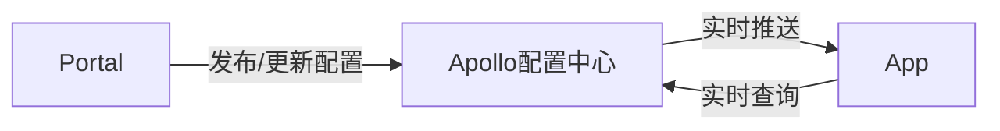

```sequence
Alice->Bob: Hello Bob, how are you?
Note right of Bob: Bob thinks
Bob-->Alice: I am good thanks!
```


```flow
st=>start: Start:>https://xiaozhuanlan.com/
io=>inputoutput: verification
op=>operation: Your Operation
cond=>condition: Yes or No?
sub=>subroutine: Your Subroutine
e=>end

st->io->op->cond
cond(yes)->e
cond(no)->sub->io
```





graph TD;
    A-->B;
    A-->C;
    B-->D;
    C-->D;
